# Heater Control System – ESP32 (ESP-IDF)

## 📌 Overview
This project implements a **Heater Control System** using an **ESP32** microcontroller and the **ESP-IDF** framework.

- Controls a simulated or real heater based on temperature readings from a **TMP117 digital temperature sensor** (I²C).
- In **Wokwi simulation**, we use an **MPU6050 accelerometer/gyroscope** as a placeholder I²C device to keep the bus active, with temperature values generated in firmware.
- Monitors temperature in real-time, transitions through **Idle**, **Heating**, **Stabilizing**, **Target Reached**, **Overheat**, and **Fault** states.
- Logs all activity over **UART**.

---

## 📂 Repository Structure
```
heater_control_system/
│
├── main.c                  # Application entry point
├── heater_control.c        # State machine & control logic
├── heater_control.h
├── i2c_driver.c            # I²C init, TMP117 interface, Wokwi mock engine
├── i2c_driver.h
├── gpio_driver.c           # Heater GPIO control
├── gpio_driver.h
├── CMakeLists.txt
│
├── Heater_Control_System_Design.pdf   # Part 1: System design
├── Heater_Control_Embedded_Implementation.pdf  
#Part 2: Implementation
│
└── README.md               # (this file)
```

---

## 🛠 Features
- **Temperature-driven state machine:**
  - Idle → Heating → Stabilizing → Target Reached
  - Overheat detection & Fault auto-recovery
- Heater ON/OFF control via GPIO (LED in simulation)
- I²C temperature acquisition:
  - **Real hardware:** TMP117 digital temperature sensor
  - **Simulation:** MPU6050 placeholder + firmware temperature generator
- UART logging of temperature, state, and heater status
- **Two simulation modes** in Wokwi:
  1. Normal functional cycle (reach target at 50 °C)
  2. Overheat scenario (triggered on 2nd upper peak of Stabilizing cycle)
- FreeRTOS periodic task for 1 Hz monitoring loop
- LED heater indicator

---

## 📜 Requirements & Deliverables
**From Part 1 – System Design:**
- TMP117 over I²C for temperature sensing
- Heater controlled via GPIO
- UART logging for monitoring
- State machine for heater operation
- Overheat protection & fault handling

**From Part 2 – Implementation:**
- Wokwi simulation support
- Firmware-based mock temperature patterns
- Two selectable simulation modes
- Real hardware build option (via CMake)
- Wokwi simulation link

---

## 🔧 Build & Run

### 1. Wokwi Simulation
1. Open the Wokwi project link: **[Wokwi Simulation](https://wokwi.com/projects/439005910473186305)**
2. Upload the compiled **`heater_control.elf`** from your `build/` folder.  [Download heater_control.elf here](build/heater_control.elf)
3. Select simulation mode via UART prompt:
   - Mode 1: Normal operation
   - Mode 2: Overheat scenario
4. Observe UART logs for state transitions.

**Note:** TMP117 is not available in Wokwi, so we keep the I²C bus active by probing an **MPU6050**.

### 2. Real Hardware
1. Connect ESP32 to TMP117 via I²C.
2. In `CMakeLists.txt`, remove the `-WOKWI_SIM` compile definition.
3. Rebuild and flash firmware.
4. Monitor UART output for live readings.

---

## 📊 State Machine Summary

```mermaid
stateDiagram-v2
    [*] --> Idle
    Idle --> Heating: Temp ≥ 18°C & ≤ 32°C (stable 3s)
    Heating --> Stabilizing: Temp ≥ 48°C
    Stabilizing --> Heating: Temp < 46°C
    Stabilizing --> TargetReached: 50°C for 5s
    Stabilizing --> Overheat: Temp ≥ 60°C
    TargetReached --> Idle: Restart condition
    Overheat --> Idle: Manual reset / Recovery
    Idle --> Fault: Sensor error / unrealistic temp
    Fault --> Idle: Auto-recovery
```


---

## 📄 Documentation

- *Heater Control System – Design Document (Part 1):*  
  [Heater_Control_System_Design.pdf](https://drive.google.com/file/d/1xpcoW7fJzsuvvs_NyNr0kD80tkMxAuj-/view?usp=drivesdk)

- *Heater Control System – Embedded Implementation (Part 2):*  
  [Heater Control Embedded Implementation](https://drive.google.com/file/d/1xlTkeXc543P2LGpKaSJwQQFb-wdq7z9l/view?usp=drivesdk)

- *Wokwi Simulation:*  
  [Open Wokwi Project](https://wokwi.com/projects/439005910473186305)  
  *(Upload the heater_control.elf file from your build/ directory to run the simulation.)*
   [Download heater_control.elf here](build/heater_control.elf)

---
## Note:
**Why an I²C Gyroscope (MPU6050) Appears in the Wokwi Schematic**

### Context
On real hardware, the ESP32 reads temperature from a **TMP117** digital sensor over **I²C** and controls the heater via GPIO.  
In Wokwi, the **TMP117 part isn’t available**, so we cannot place the real temperature sensor in the simulator.

### The Problem in Simulation
If we remove/skip I²C completely and just “fake” temperatures in code, we never exercise:
- ESP-IDF **I²C driver initialization**
- The I²C **controller configuration** and pins
- The code paths that would normally deal with an I²C device on the bus

That means the simulation wouldn’t represent the real firmware conditions — risking surprises on actual hardware.

### The Practical Workaround
We place an **MPU6050 (accelerometer/gyroscope)** on the I²C bus in Wokwi as a **placeholder** I²C device because:
- It’s **available** in Wokwi’s part library and easy to wire (default address **0x68**)
- It gives the ESP32 a **real I²C target** so driver init and (optional) probing work
- It keeps the I²C stack **active** during simulation

> **Note:** We **do not** use MPU6050 data for control. Temperature values in Wokwi are generated by our **firmware mock engine** under the `WOKWI_SIM` build flag.

### How It Fits the Build
- **Simulation build:** `WOKWI_SIM` is **enabled**.  
  - The code initializes I²C and (depending on your version) either probes a known device or simply returns OK for probe calls.  
  - Temperature data comes from the **mock temperature script** (Mode 1 / Mode 2).
- **Real hardware build:** `WOKWI_SIM` is **disabled**.  
  - The ESP32 talks to **TMP117** at **0x48**, reads real temperature over I²C, and controls the heater.

**Toggle example (CMakeLists.txt):**
```cmake
# For Wokwi simulation
add_compile_definitions(WOKWI_SIM=1)

# For real hardware (comment out the line above or remove WOKWI_SIM)

```

---

## 🚀 Future Roadmap
- Dual-sensor redundancy
- Multiple heating profiles
- BLE-based wireless monitoring/control
- TMP117 ALERT pin for ISR-based overheat shutdown

